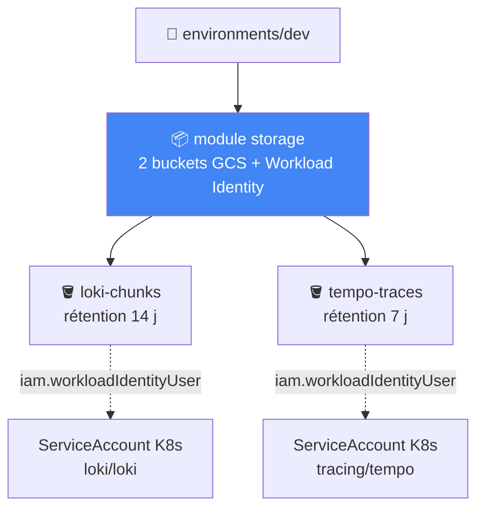
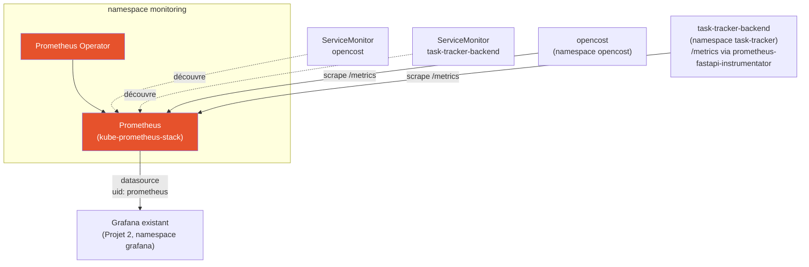

# Observability & SRE Platform

Couche observabilité et fiabilité (SRE) pour la plateforme applicative des
Projets 1 et 2 — métriques, logs, traces, objectifs de fiabilité chiffrés
(SLI/SLO) et réponse à incident outillée (alerting + runbooks). Construite
en suivant
[Projet-3-Observability-SRE-Guide.md](Projet-3-Observability-SRE-Guide.md).

Ce dépôt est **séparé** de [Projet 1](https://github.com/amadouldiallo/gcp-platform)
et [Projet 2](https://github.com/amadouldiallo/gitops-platform) — son
propre code Terraform (`terraform/`), indépendant des modules des deux
autres dépôts. Mais contrairement au Projet 2 (qui provisionne son propre
cluster GKE), **ce projet ne crée aucun cluster** : il se déploie sur le
cluster `gitops-platform` déjà provisionné par le Projet 2. Voir
§Infrastructure pour le raisonnement complet.

## Comment lire ce dépôt

Mêmes symboles que les Projets 1 et 2 en tête de bloc de commentaire :

| Symbole | Signification |
|---|---|
| 🎯 | Le concept — ce que fait le composant, en langage simple |
| 🧠 | Analogie — pour ancrer le concept dans quelque chose de concret |
| ❓ | Pourquoi c'est important — la conséquence si on s'en passe |
| ⚠️ | Piège — une erreur facile à faire, rencontrée en écrivant ce code |
| 🔭 | Pour aller plus loin — une amélioration volontairement pas faite ici |

## Avancement

| Étape du guide | Dossier(s) | Statut |
|---|---|---|
| — Infrastructure (Terraform) | `terraform/` | ✅ **appliquée pour de vrai** — buckets GCS + Workload Identity actifs sur GCP, voir §Infrastructure |
| 1 — Métriques (Prometheus) | `k8s/monitoring/` | ✅ **déployé et testé sur le vrai cluster** — voir §Métriques |
| 2 — Logs (Loki) | `k8s/loki/` | ⬜ à faire |
| 3 — Traces (OpenTelemetry + Tempo) | `k8s/tracing/` | ⬜ à faire |
| 4 — Golden Signals | `k8s/dashboards/` | ⬜ à faire |
| 5 — SLI | `docs/slo.md` | ⬜ à faire |
| 6 — SLO | `docs/slo.md` | ⬜ à faire |
| 7 — Alerting | `k8s/alerting/` | ⬜ à faire |
| 8 — Simulation d'incident | `docs/incident-drill.md` | ⬜ à faire |
| 9 — Runbooks | `docs/runbooks/` | ⬜ à faire |

## Infrastructure (Terraform)

`terraform/` ne provisionne **ni réseau ni cluster** — les deux existent
déjà (Projet 2). Il crée uniquement ce dont Loki et Tempo ont besoin pour
ne pas perdre leurs données au prochain remplacement de node : deux
buckets GCS dédiés (logs, traces) et les bindings Workload Identity qui
permettent à leurs pods d'y écrire sans clé JSON.



❓ **Pourquoi GCS et pas un simple PVC** : ce même cluster a déjà perdu la
configuration de Vault (Projet 2, Étape 7) lors d'un remplacement de node
pool — les données sur disque local d'un pod ne survivent pas au
déplacement de ce pod vers un autre node. Un bucket GCS, lui, existe
indépendamment du cycle de vie des pods et des nodes.

⚠️ **Piège anticipé** : le nom du ServiceAccount Kubernetes attendu par le
binding Workload Identity (`loki/loki`, `tracing/tempo`) doit correspondre
exactement à celui créé par le chart Helm — vérifié via
`kubectl get sa -n <namespace>` avant d'annoter, pas supposé.

```bash
cd terraform/environments/dev
cp terraform.tfvars.example terraform.tfvars   # project_id (celui du cluster gitops-platform)
cp backend.hcl.example backend.hcl             # même bucket de state que les Projets 1/2
terraform init -backend-config=backend.hcl
terraform plan     # 11 to add, 0 to change, 0 to destroy — testé contre un vrai projet GCP
terraform apply
```

⚠️ **Ces buckets sont actuellement appliqués et actifs**
(`devops-498817-loki-chunks`, `devops-498817-tempo-traces`,
europe-west1) — coût marginal (stockage seul, purge automatique à 14/7
jours) mais réel. `terraform destroy` depuis
`terraform/environments/dev` les supprime proprement.

## Métriques (Prometheus)

`k8s/monitoring/` déploie `kube-prometheus-stack` (Prometheus Operator) et
migre TOUT ce qui scrapait déjà des métriques sur ce cluster — plutôt que
de faire tourner un second Prometheus à côté du premier.



❓ **Pourquoi une migration, pas une installation à côté** : le Projet 2
faisait déjà tourner un Prometheus "nu" (`prometheus-community/prometheus`)
pour OpenCost. En installer un second aurait dupliqué node-exporter et
kube-state-metrics, et créé une ambiguïté sur lequel Grafana interroge.
L'ancien release a été désinstallé (`helm uninstall prometheus -n
prometheus-system`) avant l'installation du nouveau.

**Bugs réels rencontrés en testant sur le cluster :**

1. **Le pod Prometheus restait `Pending`** — `0/4 nodes are available: 4
   Insufficient cpu`. Les 4 nodes e2-medium du cluster (Projet 2)
   tournaient déjà à 79-97% de leur CPU allouable (Argo CD, Vault,
   cert-manager, External Secrets, OpenCost, Grafana, ingress-nginx,
   task-tracker...) ; la mémoire, elle, avait largement de la marge
   (41-62%). Plutôt que remonter `total_max_node_count` par réflexe (déjà
   fait, puis délibérément corrigé, au Projet 2), la requête CPU de
   Prometheus a été réduite de 200m à 100m (la limite reste à 500m) — un
   Prometheus de lab n'a simplement pas besoin de 200m garantis.
2. **`kubeControllerManager`, `kubeScheduler`, `kubeEtcd`, `kubeProxy` et
   `coreDns` restaient tous "down"** dans la page Targets — GKE est un
   control plane managé par Google, ces composants ne sont jamais exposés
   au cluster. Désactivés explicitement (`enabled: false`) plutôt que
   laissés comme bruit permanent.
3. **`prometheus-fastapi-instrumentator==8.1.0` refusait de s'installer**
   dans l'image backend (voir dépôt gitops-platform) — conflit de
   dépendances avec `starlette` (8.1.0 exige `>=1.0.0`, une version qui
   n'existe pas encore pour la branche compatible avec `fastapi==0.115.6`
   épinglé). Fixé en épinglant `7.1.0`.

**Vérifié réellement, pas juste déployé :**
- `curl .../metrics` sur le backend, en générant du vrai trafic
  (`curl .../api/tasks` x15), montre `http_requests_total{handler="/api/tasks",...} 15.0`.
- Les deux `ServiceMonitor` (opencost, task-tracker-backend) apparaissent
  `up` dans `/api/v1/targets` de Prometheus.
- Le dashboard FinOps existant (Projet 2, `k8s/finops/`) a été requêté
  APRÈS bascule du datasource Grafana vers ce nouveau Prometheus — même
  requête PromQL, toujours des données réelles (`0.102 $/h`), aucune
  régression.

```bash
# Désinstalle l'ancien Prometheus "nu" du Projet 2
helm uninstall prometheus -n prometheus-system

# Installe le Prometheus Operator
helm install kube-prometheus-stack prometheus-community/kube-prometheus-stack \
  -n monitoring --create-namespace \
  -f k8s/monitoring/values.yaml --wait

kubectl apply -f k8s/monitoring/servicemonitor-opencost.yaml
kubectl apply -f k8s/monitoring/servicemonitor-backend.yaml
```

⚠️ Nécessite aussi deux changements côté dépôt **gitops-platform**
(Projet 2, pas dupliqués ici) : l'instrumentation `/metrics` du backend et
l'ouverture de `backend-allow-from-frontend` au namespace `monitoring` —
voir sa section [§Évolutions liées au Projet 3](https://github.com/amadouldiallo/gitops-platform#-évolutions-liées-au-projet-3).

---

*Les sections suivantes (§Logs, §Traces, §Golden Signals, §SLI/SLO,
§Alerting, §Simulation d'incident, §Runbooks) seront ajoutées au fil de
l'avancement réel, chacune testée sur le cluster avant d'être documentée —
même discipline que les Projets 1 et 2.*
