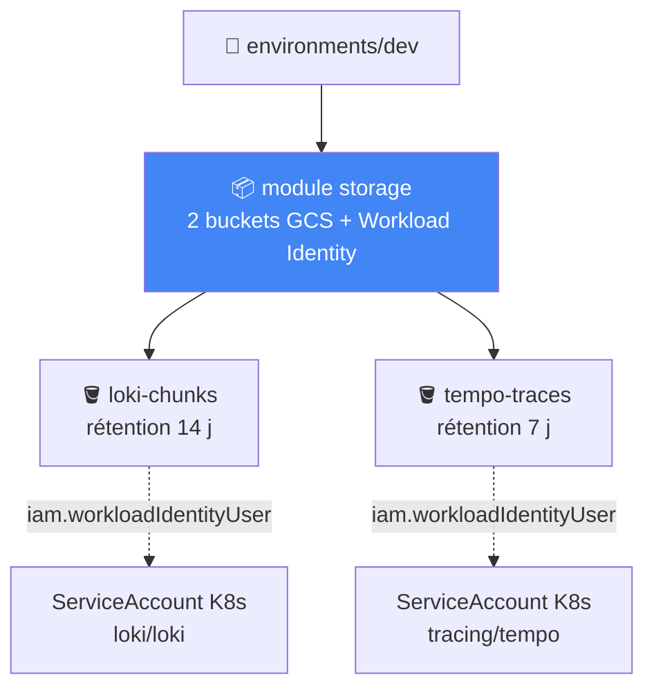
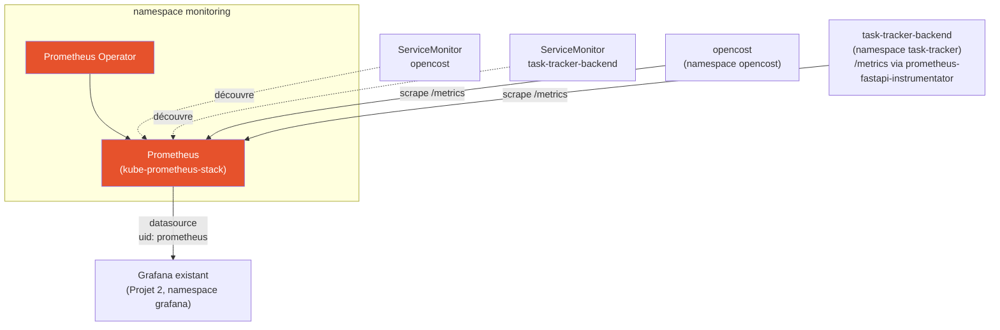
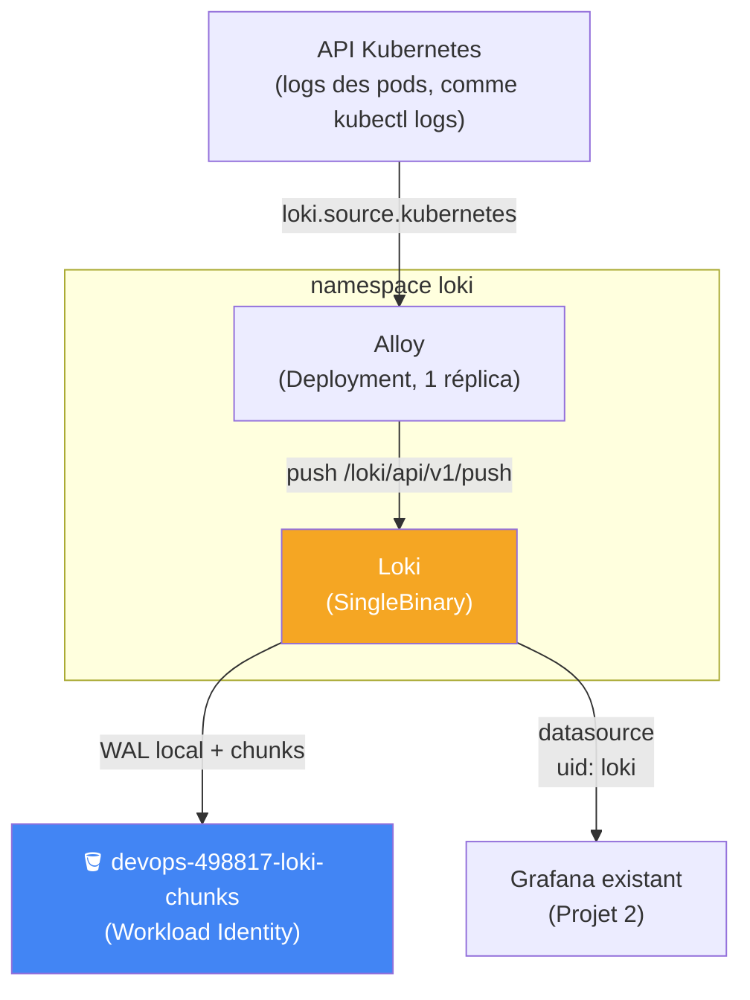
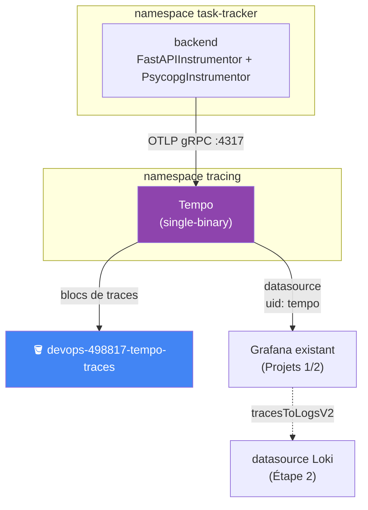
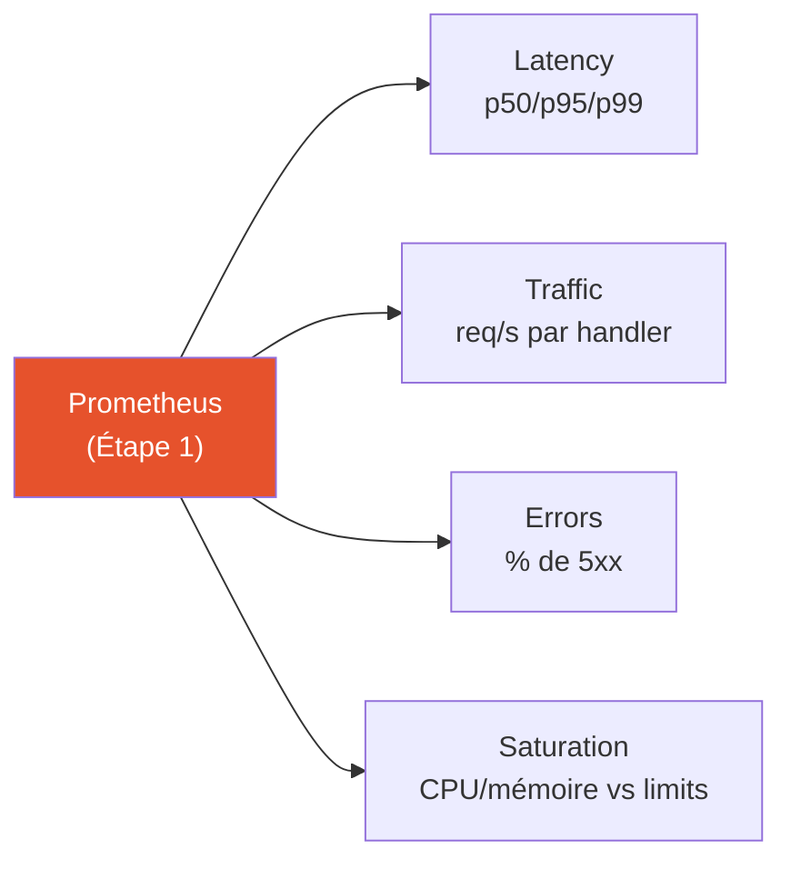

# Observability & SRE Platform

Couche observabilité et fiabilité (SRE) pour la plateforme applicative des
Projets 1 et 2 — métriques, logs, traces, objectifs de fiabilité chiffrés
(SLI/SLO) et réponse à incident outillée (alerting + runbooks). Construite
en suivant
[Projet-3-Observability-SRE-Guide.md](Projet-3-Observability-SRE-Guide.md).

Ce dépôt est **séparé** de [Projet 1](https://github.com/amadouldiallo/gcp-platform)
et [Projet 2](https://github.com/amadouldiallo/gitops-platform) — son
propre code Terraform (`terraform/`), indépendant des modules des deux
autres dépôts. Mais contrairement au Projet 2 (qui provisionne son propre
cluster GKE), **ce projet ne crée aucun cluster** : il se déploie sur le
cluster `gitops-platform` déjà provisionné par le Projet 2. Voir
§Infrastructure pour le raisonnement complet.

## Comment lire ce dépôt

Mêmes symboles que les Projets 1 et 2 en tête de bloc de commentaire :

| Symbole | Signification |
|---|---|
| 🎯 | Le concept — ce que fait le composant, en langage simple |
| 🧠 | Analogie — pour ancrer le concept dans quelque chose de concret |
| ❓ | Pourquoi c'est important — la conséquence si on s'en passe |
| ⚠️ | Piège — une erreur facile à faire, rencontrée en écrivant ce code |
| 🔭 | Pour aller plus loin — une amélioration volontairement pas faite ici |

## Avancement

| Étape du guide | Dossier(s) | Statut |
|---|---|---|
| — Infrastructure (Terraform) | `terraform/` | ✅ **appliquée pour de vrai** — buckets GCS + Workload Identity actifs sur GCP, voir §Infrastructure |
| 1 — Métriques (Prometheus) | `k8s/monitoring/` | ✅ **déployé et testé sur le vrai cluster** — voir §Métriques |
| 2 — Logs (Loki) | `k8s/loki/` | ✅ **déployé et testé sur le vrai cluster** — voir §Logs |
| 3 — Traces (OpenTelemetry + Tempo) | `k8s/tracing/` | ✅ **déployé et testé sur le vrai cluster** — voir §Traces |
| 4 — Golden Signals | `k8s/dashboards/` | ✅ **déployé et testé sur le vrai cluster** — voir §Golden Signals |
| 5 — SLI | `docs/slo.md` | ✅ **3 SLI définis et vérifiés contre de vraies données** — voir §SLI |
| 6 — SLO | `docs/slo.md` | ✅ **objectifs + error budget définis, vérifiés sur GKE** — voir §SLO |
| 7 — Alerting | `k8s/alerting/` | ✅ **déployé et testé sur le vrai cluster** — voir §Alerting |
| 8 — Simulation d'incident | `docs/incident-drill.md` | ⬜ à faire |
| 9 — Runbooks | `docs/runbooks/` | ⬜ à faire |

## Infrastructure (Terraform)

`terraform/` ne provisionne **ni réseau ni cluster** — les deux existent
déjà (Projet 2). Il crée uniquement ce dont Loki et Tempo ont besoin pour
ne pas perdre leurs données au prochain remplacement de node : deux
buckets GCS dédiés (logs, traces) et les bindings Workload Identity qui
permettent à leurs pods d'y écrire sans clé JSON.



❓ **Pourquoi GCS et pas un simple PVC** : ce même cluster a déjà perdu la
configuration de Vault (Projet 2, Étape 7) lors d'un remplacement de node
pool — les données sur disque local d'un pod ne survivent pas au
déplacement de ce pod vers un autre node. Un bucket GCS, lui, existe
indépendamment du cycle de vie des pods et des nodes.

⚠️ **Piège anticipé** : le nom du ServiceAccount Kubernetes attendu par le
binding Workload Identity (`loki/loki`, `tracing/tempo`) doit correspondre
exactement à celui créé par le chart Helm — vérifié via
`kubectl get sa -n <namespace>` avant d'annoter, pas supposé.

```bash
cd terraform/environments/dev
cp terraform.tfvars.example terraform.tfvars   # project_id (celui du cluster gitops-platform)
cp backend.hcl.example backend.hcl             # même bucket de state que les Projets 1/2
terraform init -backend-config=backend.hcl
terraform plan     # 11 to add, 0 to change, 0 to destroy — testé contre un vrai projet GCP
terraform apply
```

⚠️ **Ces buckets sont actuellement appliqués et actifs**
(`devops-498817-loki-chunks`, `devops-498817-tempo-traces`,
europe-west1) — coût marginal (stockage seul, purge automatique à 14/7
jours) mais réel. `terraform destroy` depuis
`terraform/environments/dev` les supprime proprement.

## Métriques (Prometheus)

`k8s/monitoring/` déploie `kube-prometheus-stack` (Prometheus Operator) et
migre TOUT ce qui scrapait déjà des métriques sur ce cluster — plutôt que
de faire tourner un second Prometheus à côté du premier.



❓ **Pourquoi une migration, pas une installation à côté** : le Projet 2
faisait déjà tourner un Prometheus "nu" (`prometheus-community/prometheus`)
pour OpenCost. En installer un second aurait dupliqué node-exporter et
kube-state-metrics, et créé une ambiguïté sur lequel Grafana interroge.
L'ancien release a été désinstallé (`helm uninstall prometheus -n
prometheus-system`) avant l'installation du nouveau.

**Bugs réels rencontrés en testant sur le cluster :**

1. **Le pod Prometheus restait `Pending`** — `0/4 nodes are available: 4
   Insufficient cpu`. Les 4 nodes e2-medium du cluster (Projet 2)
   tournaient déjà à 79-97% de leur CPU allouable (Argo CD, Vault,
   cert-manager, External Secrets, OpenCost, Grafana, ingress-nginx,
   task-tracker...) ; la mémoire, elle, avait largement de la marge
   (41-62%). Plutôt que remonter `total_max_node_count` par réflexe (déjà
   fait, puis délibérément corrigé, au Projet 2), la requête CPU de
   Prometheus a été réduite de 200m à 100m (la limite reste à 500m) — un
   Prometheus de lab n'a simplement pas besoin de 200m garantis.
2. **`kubeControllerManager`, `kubeScheduler`, `kubeEtcd`, `kubeProxy` et
   `coreDns` restaient tous "down"** dans la page Targets — GKE est un
   control plane managé par Google, ces composants ne sont jamais exposés
   au cluster. Désactivés explicitement (`enabled: false`) plutôt que
   laissés comme bruit permanent.
3. **`prometheus-fastapi-instrumentator==8.1.0` refusait de s'installer**
   dans l'image backend (voir dépôt gitops-platform) — conflit de
   dépendances avec `starlette` (8.1.0 exige `>=1.0.0`, une version qui
   n'existe pas encore pour la branche compatible avec `fastapi==0.115.6`
   épinglé). Fixé en épinglant `7.1.0`.

**Vérifié réellement, pas juste déployé :**
- `curl .../metrics` sur le backend, en générant du vrai trafic
  (`curl .../api/tasks` x15), montre `http_requests_total{handler="/api/tasks",...} 15.0`.
- Les deux `ServiceMonitor` (opencost, task-tracker-backend) apparaissent
  `up` dans `/api/v1/targets` de Prometheus.
- Le dashboard FinOps existant (Projet 2, `k8s/finops/`) a été requêté
  APRÈS bascule du datasource Grafana vers ce nouveau Prometheus — même
  requête PromQL, toujours des données réelles (`0.102 $/h`), aucune
  régression.

```bash
# Désinstalle l'ancien Prometheus "nu" du Projet 2
helm uninstall prometheus -n prometheus-system

# Installe le Prometheus Operator
helm install kube-prometheus-stack prometheus-community/kube-prometheus-stack \
  -n monitoring --create-namespace \
  -f k8s/monitoring/values.yaml --wait

kubectl apply -f k8s/monitoring/servicemonitor-opencost.yaml
kubectl apply -f k8s/monitoring/servicemonitor-backend.yaml
```

⚠️ Nécessite aussi deux changements côté dépôt **gitops-platform**
(Projet 2, pas dupliqués ici) : l'instrumentation `/metrics` du backend et
l'ouverture de `backend-allow-from-frontend` au namespace `monitoring` —
voir sa section [§Évolutions liées au Projet 3](https://github.com/amadouldiallo/gitops-platform#-évolutions-liées-au-projet-3).

## Logs (Loki)

`k8s/loki/` déploie Loki en mode `SingleBinary`, stockage GCS (le bucket
`devops-498817-loki-chunks` provisionné à l'Étape 0), et Grafana Alloy
pour collecter les logs réels du namespace `task-tracker`.



❓ **Pourquoi Alloy en `Deployment`, pas en `DaemonSet`** (le défaut du
chart) : `loki.source.kubernetes` lit les logs via l'API Kubernetes — comme
`kubectl logs -f`, pas via le système de fichiers local du node. Un seul
pod peut donc streamer les logs de n'importe quel pod du cluster, peu
importe le node — un DaemonSet n'a de sens que pour un agent qui lit des
fichiers locaux (Promtail, aujourd'hui déprécié, en avait besoin).

**Bugs réels rencontrés en testant sur le cluster :**

1. **Les 2 caches memcached du chart (chunks-cache, results-cache) restaient
   `Pending`** — activés par défaut, 500m CPU / 1Gi mémoire CHACUN, sans
   utilité mesurable au volume de logs d'un lab. Désactivés.
2. **Les pods Alloy (DaemonSet, config initiale) restaient `Pending` sur 3
   nodes sur 4.** Réflexe testé : remonter `total_max_node_count` (4→5,
   dépôt gitops-platform) pour donner de l'air au cluster-autoscaler —
   **sans le moindre effet**, et `cluster-autoscaler-status` (namespace
   kube-system) explique pourquoi : un pod de DaemonSet déjà créé est
   épinglé, via `nodeAffinity`, au node EXISTANT que le contrôleur lui a
   assigné à sa création — ajouter un 5ᵉ node ne libère AUCUNE capacité
   sur les 4 nodes déjà pleins. Changement Terraform annulé, root cause
   corrigée à la racine : `controller.type: deployment` (voir ci-dessus).
3. **Aucun chunk n'apparaissait dans le bucket GCS**, même après plusieurs
   minutes d'attente et une réduction de `chunk_idle_period`/`max_chunk_age`.
   Les logs de l'ingester révélaient la vraie cause :
   `failed to flush chunks: store put chunk: mkdir fake: read-only file
   system` — `useTestSchema: true` (le raccourci du chart pour "tester
   sans se prendre la tête") résolvait `object_store` à `filesystem`, PAS
   à `gcs`, malgré `storage.type: gcs` déjà configuré par ailleurs.
   Confirmé en dumpant la ConfigMap rendue (`kubectl get cm loki -o yaml`).
   Fixé en écrivant `schemaConfig` explicitement plutôt que via le
   raccourci — la doc du chart prévenait qu'un "vrai" déploiement en avait
   besoin ; vrai plus tôt que prévu, dès le lab.

**Vérifié réellement, pas juste déployé :**
- `gsutil ls gs://devops-498817-loki-chunks/` montre de vrais objets
  (`fake/<fingerprint>/...`) après la correction du schéma.
- Une requête LogQL (`{namespace="task-tracker", app="backend"}`) sur du
  trafic généré en direct (`curl .../api/tasks`) retourne les vraies
  lignes de log de l'application (`INFO: ... "GET /readyz HTTP/1.1" 200`).
- Datasource Grafana Loki : `{"status":"OK","message":"Data source
  successfully connected."}` via l'API santé de Grafana.

```bash
helm install loki grafana/loki -n loki --create-namespace \
  -f k8s/loki/values.yaml --version 7.3.0 --wait

helm install alloy grafana/alloy -n loki \
  -f k8s/loki/alloy-values.yaml --version 1.12.1 --wait

kubectl apply -f k8s/loki/grafana-datasource.yaml
kubectl rollout restart deployment/grafana -n grafana
```

## Traces (OpenTelemetry + Tempo)

`k8s/tracing/` déploie Tempo (mode single-binary, chart `grafana/tempo` —
PAS `tempo-distributed`), stockage GCS (`devops-498817-tempo-traces`), et
le backend (dépôt gitops-platform) exporte ses traces directement vers le
récepteur OTLP de Tempo — pas de Collector séparé, un composant de moins
sur un cluster déjà à court de CPU (voir Étapes 1 et 2).



❓ **Pourquoi le backend exporte directement vers Tempo, sans OTel
Collector** : pour un lab où le backend est la SEULE source de traces, un
Collector n'ajouterait qu'un composant de plus à faire tourner (buffering,
retraitement) sans consommateur du bénéfice qu'il apporte — Tempo expose
déjà nativement les récepteurs OTLP gRPC/HTTP.

🔭 **Scope volontairement limité** : la trace couvre backend → PostgreSQL,
pas frontend → backend — le frontend est un simple proxy nginx statique,
l'instrumenter aurait demandé un module nginx OTel tiers hors scope pour
ce lab (le guide vise "visualiser le parcours", pas une couverture à 100%).

**Bugs réels rencontrés en testant sur le cluster :**

1. **`tempo-0` en `CrashLoopBackOff`** dès le premier démarrage : `Error
   403: tempo-storage@... does not have storage.buckets.get access`.
   `roles/storage.objectAdmin` (déjà accordé, comme pour Loki) couvre les
   opérations sur les OBJETS mais PAS `storage.buckets.get`, que Tempo
   appelle AU DÉMARRAGE pour vérifier les attributs du bucket — un besoin
   que Loki n'a, lui, jamais manifesté. Fixé en ajoutant
   `roles/storage.legacyBucketReader` (mécanisme `extra_roles`, module
   Terraform généralisé pour l'occasion — voir
   `terraform/modules/storage/main.tf`).
2. **La moitié des traces dans Tempo ne contenaient qu'un span `SELECT`
   isolé**, sans le span HTTP parent attendu. Root-caused côté dépôt
   gitops-platform : `/readyz` (exclu du traçage HTTP) déclenchait quand
   même un span `PsycopgInstrumentor` pour son `SELECT 1` toutes les 5s
   (cadence de la sonde readiness), sans contexte parent — une trace
   orpheline par appel. Fixé avec `suppress_instrumentation()` autour de
   cet appel précis (voir le commit correspondant dans gitops-platform).
3. **Datasource Grafana Tempo en timeout** (`dial tcp ... i/o timeout`) :
   la `NetworkPolicy` initiale n'autorisait que `task-tracker` (écriture
   OTLP, port 4317) — Grafana (namespace `grafana`) interroge Tempo sur un
   port DIFFÉRENT (3200, l'API de query), depuis un namespace différent.
   Même famille de piège que `backend-allow-from-frontend` au Projet 2
   (le bon expéditeur, le mauvais port) — fixé en ajoutant une seconde
   règle d'ingress dédiée.

**Vérifié réellement, pas juste déployé :** une trace `GET /api/tasks`
récupérée via l'API Tempo (`/api/traces/<id>`) montre le span racine
`GET /api/tasks` (`SPAN_KIND_SERVER`) avec un span enfant `SELECT`
(`SPAN_KIND_CLIENT`, `parentSpanId` = l'ID du span HTTP) — le chaînage
HTTP → SQL fonctionne, pas seulement "des spans existent quelque part".

```bash
helm install tempo grafana/tempo -n tracing \
  -f k8s/tracing/values.yaml --version 1.24.4 --wait

kubectl apply -f k8s/tracing/networkpolicy.yaml
kubectl apply -f k8s/tracing/grafana-datasource.yaml
kubectl rollout restart deployment/grafana -n grafana
```

## Golden Signals

`k8s/dashboards/golden-signals-backend.yaml` — un dashboard Grafana à 4
panels (Latency, Traffic, Errors, Saturation), provisionné par ConfigMap
comme le dashboard FinOps du Projet 2.



❓ **Pourquoi exclure `/metrics`, `/healthz`, `/readyz` de Latency et
Traffic** : ce sont des endpoints sondés en continu (kube-probe toutes les
5-10s, Prometheus lui-même toutes les 30s) — les inclure noierait le
signal utile (le trafic RÉEL des utilisateurs) sous du bruit de sonde,
exactement le même réflexe déjà appliqué à l'instrumentation elle-même
(voir `excluded_handlers` dans `apps/backend/app/main.py`, dépôt
gitops-platform).

**Vérifié réellement, pas juste déployé :** chacune des 4 requêtes PromQL
a été exécutée directement contre Prometheus AVANT d'être collée dans le
JSON du dashboard (pas après, pour éviter de découvrir une erreur de
syntaxe une fois dans l'UI) :

| Panel | Résultat observé (trafic réel généré) |
|---|---|
| Latency p95 | `0.095` s |
| Traffic | `0.028` req/s |
| Errors | `0` (aucune erreur 5xx survenue — la première viendra de l'Étape 8) |
| Saturation CPU | `0.7 %` de la limite |
| Saturation mémoire | `19.9 %` de la limite |

Le dashboard s'est ensuite chargé et confirmé accessible via l'API Grafana
(`GET /api/dashboards/uid/golden-signals-backend` → 4 panels).

```bash
kubectl apply -f k8s/dashboards/golden-signals-backend.yaml
```

## SLI

[docs/slo.md](docs/slo.md) définit 3 SLI PromQL pour le backend —
disponibilité, taux d'erreur, latence sous 300ms — chacun vérifié
directement contre Prometheus avec du trafic réel avant d'être documenté.

⚠️ **Piège rencontré pour de vrai** : le SLI de latence ("% sous 300ms")
était incalculable avec les bornes d'histogramme par défaut de
`prometheus-fastapi-instrumentator` (`0.1, 0.5, 1` — aucune à 0.3
exactement). Un histogramme Prometheus ne répond qu'aux seuils qui
correspondent à une de ses bornes `le=...` — fixé en personnalisant les
bornes du backend (`apps/backend/app/main.py`, dépôt gitops-platform) pour
inclure `0.3`. Détail complet et requêtes vérifiées dans
[docs/slo.md](docs/slo.md).

## SLO

[docs/slo.md](docs/slo.md) (mis à jour) — objectifs : disponibilité ≥
99,9%, taux d'erreur < 0,1%, latence p95 < 300ms, sur 30 jours glissants.
Error budget calculé : **43,2 minutes d'indisponibilité tolérées par mois**.

⚠️ **Piège rencontré pour de vrai** : les requêtes PromQL "manuel"
(fenêtre `[30d]`) s'exécutent sans erreur et renvoient un résultat
plausible — mais ce Prometheus a une rétention de **6h seulement**
(décision délibérée de l'Étape 1, Prometheus n'étant pas la source de
vérité long terme ici). Une fenêtre plus longue que la rétention réelle
ne produit PAS d'erreur, elle calcule silencieusement sur les seules
données disponibles tout en prétendant couvrir 30 jours — vérifié
directement via `/api/v1/status/runtimeinfo`. Documenté avec deux
versions des requêtes dans `docs/slo.md` : la version "manuel" (30j,
correcte en principe, pas vérifiable sur ce lab) et la version réellement
utilisée sur ce cluster (fenêtre 1h, adaptée à la rétention réelle) — un
vrai SLO à 30 jours demanderait un stockage long terme (Thanos, Mimir),
délibérément hors scope ici.

## Alerting

`k8s/alerting/prometheusrules.yaml` — 4 règles d'alerte, chacune avec un
lien `runbook_url` (Étape 9, pas encore écrit — référence en avance, dans
l'ordre du guide) :

| Alerte | Condition | Sévérité |
|---|---|---|
| `HighErrorRate` | taux d'erreur 5xx > 1% pendant 5 min | warning |
| `HighLatency` | p95 > 500ms pendant 5 min | warning |
| `TaskTrackerPodCrashLooping` | `CrashLoopBackOff` sur un pod task-tracker pendant 5 min | critical |
| `SLOViolation` | > 80% de l'error budget consommé (fenêtre 1h, voir Étape 6) | critical |

❓ **Pourquoi pas de règle `PodCrashLooping` générique** : `kube-prometheus-stack`
(Étape 1, `defaultRules.enabled: true`) fournit déjà `KubePodCrashLooping`,
une règle standard cluster-wide — vérifié directement (`kubectl get
prometheusrule kube-prometheus-stack-kubernetes-apps`). La dupliquer
aurait fait sonner deux alertes pour le même événement. `TaskTrackerPodCrashLooping`
réutilise la même formule éprouvée, mais scopée au namespace applicatif,
avec un runbook spécifique plutôt que générique.

⚠️ **Aucun canal de notification configuré** (receiver `"null"` par
défaut d'Alertmanager) — même choix assumé que l'alerte FinOps du
Projet 2 : ces règles passent en `Firing`, visibles dans l'UI, sans
notifier personne activement.

**Vérifié réellement, pas juste déployé** : les 4 règles apparaissent
dans `/api/v1/rules` avec `health: "ok"` et `state: "inactive"` — chaque
expression PromQL s'évalue sans erreur, et n'est PAS en train de sonner
(cohérent : aucune erreur 5xx, latence p95 à 95ms, aucun crash loop —
Étapes 4/5/6). La première vraie transition `inactive` → `firing` viendra
de la simulation d'incident, Étape 8.

```bash
kubectl apply -f k8s/alerting/prometheusrules.yaml
```

---

*Les sections suivantes (§Simulation d'incident, §Runbooks) seront
ajoutées au fil de l'avancement réel, chacune testée sur le cluster avant
d'être documentée — même discipline que les Projets 1 et 2.*
